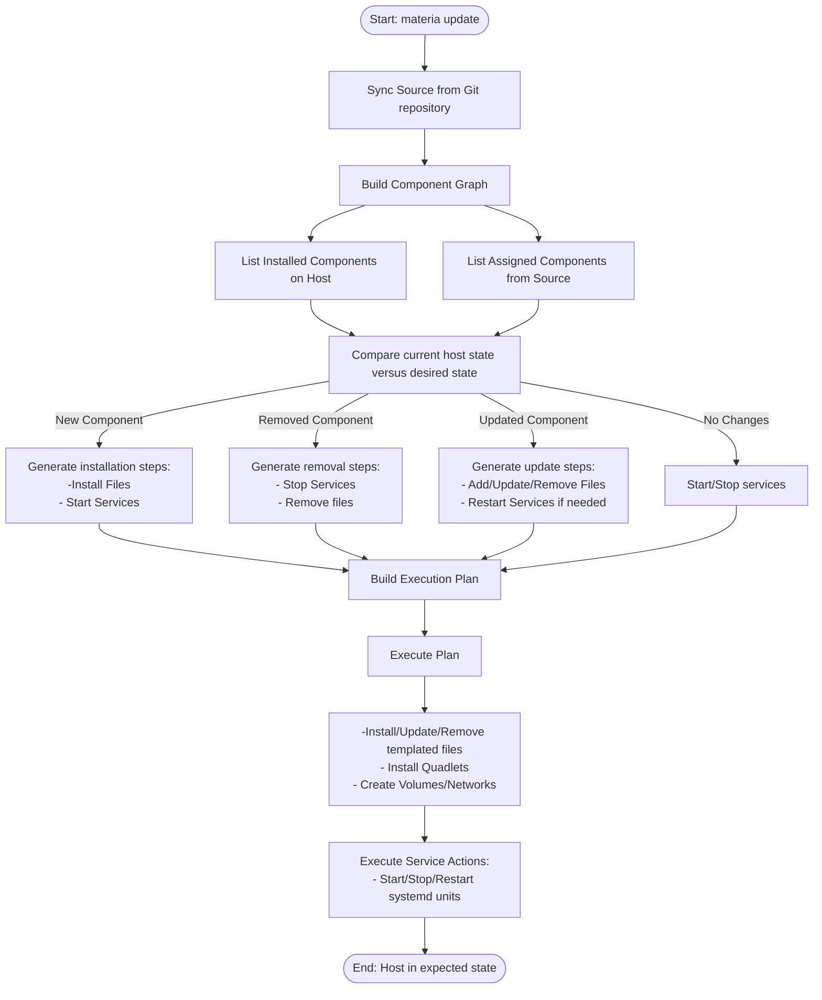

# Materia workflow diagram

An example digram of what the `materia update` command does

```mermaid
graph TD
    Start([Start: materia update]) --> SyncSources[Sync Source from Git repository]

    SyncSources --> BuildGraph[Build Component Graph]
    BuildGraph --> ListInstalled[List Installed Components on Host]
    BuildGraph --> ListAssigned[List Assigned Components from Source]

    ListInstalled --> CompareStates[Compare current host state versus desired state]
    ListAssigned --> CompareStates
    CompareStates -->|New Component| GenFresh[Generate installation steps: </br>-Install Files<br/>- Start Services]

    CompareStates -->|Removed Component| GenRemove[Generate removal steps:<br/>- Stop Services<br/>- Remove files]

    CompareStates -->|Updated Component| GenUpdate[Generate update steps:<br/>- Add/Update/Remove Files<br/>- Restart Services if needed]

    CompareStates -->|No Changes| GenUnchanged[Start/Stop services]

    GenFresh --> BuildPlan[Build Execution Plan]
    GenRemove --> BuildPlan
    GenUpdate --> BuildPlan
    GenUnchanged --> BuildPlan

    BuildPlan --> ExecutePlan[Execute Plan]

    ExecutePlan --> ExecResources[-Install/Update/Remove templated files<br/>- Install Quadlets<br/>- Create Volumes/Networks]

    ExecResources --> ExecServices[Execute Service Actions:<br/>- Start/Stop/Restart systemd units<br/>]

    ExecServices --> End([End: Host in expected state])
```

