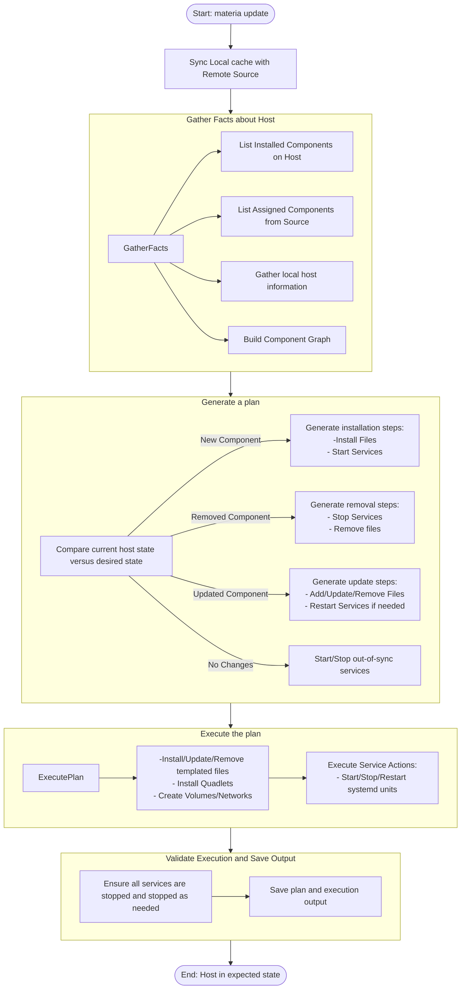

# Materia workflow diagram

An example digram of what the `materia update` command does. This works the same way for both CLI and server mode.

```mermaid
graph TD
    Start([Start: materia update])
    SyncSources[Sync Local cache with Remote Source]

    subgraph GatherFactsGraph[Gather Facts about Host]
        GatherFacts --> ListInstalled[List Installed Components on Host]
        GatherFacts --> ListAssigned[List Assigned Components from Source]
        GatherFacts --> LookupInfo[Gather local host information]
        GatherFacts --> BuildGraph[Build Component Graph]
    end

    subgraph PlanUpdatesGraph[Generate a plan]
        CompareStates[Compare current host state versus desired state]
        CompareStates -->|New Component| GenFresh[Generate installation steps: </br>-Install Files<br/>- Start Services]
        CompareStates -->|Removed Component| GenRemove[Generate removal steps:<br/>- Stop Services<br/>- Remove files]
        CompareStates -->|Updated Component| GenUpdate[Generate update steps:<br/>- Add/Update/Remove Files<br/>- Restart Services if needed]
        CompareStates -->|No Changes| GenUnchanged[Start/Stop out-of-sync services]
    end

    subgraph ExecutePlanGraph[Execute the plan]
        ExecutePlan --> ExecResources[-Install/Update/Remove templated files<br/>- Install Quadlets<br/>- Create Volumes/Networks]
        ExecResources --> ExecServices[Execute Service Actions:<br/>- Start/Stop/Restart systemd units<br/>]
    end

    subgraph FinalizeGraph[Validate Execution and Save Output]
        CheckServices[Ensure all services are stopped and stopped as needed] --> SaveOutput[Save plan and execution output]
    end

    End([End: Host in expected state])

    Start --> SyncSources
    SyncSources --> GatherFactsGraph
    GatherFactsGraph --> PlanUpdatesGraph
    PlanUpdatesGraph --> ExecutePlanGraph
    ExecutePlanGraph --> FinalizeGraph
    FinalizeGraph --> End
```

